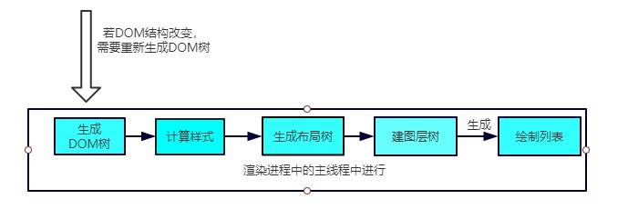

# 浏览器的回流和重绘

- 回流必将引起重绘，重绘不一定会引起回流。

## 1. 回流 (Reflow)

当Render Tree中部分或全部元素的尺寸、结构、或某些属性发生改变时，浏览器重新渲染部分或全部文档的过程称为回流。即当我们对 DOM 结构的修改引发 DOM 几何尺寸变化的时候，会发生回流的过程。

回流过程：

### 会导致回流的操作：

- 页面首次渲染

- 浏览器窗口大小发生改变

- 元素尺寸或位置发生改变
- 元素内容变化（文字数量或图片大小等等）
- 元素字体大小变化
- 添加或者删除可见的DOM元素
- 激活CSS伪类（例如：:hover）
- 查询某些属性或调用某些方法

- 一个 DOM 元素的几何属性变化，常见的几何属性有width、height、padding、margin、left、top、border 等等, 这很好理解。

- 使 DOM 节点发生增减或者移动。

- 读写 offset族、scroll族和client族属性的时候，浏览器为了获取这些值，需要进行回流操作。

- 调用 window.getComputedStyle 方法。

### 一些常用且会导致回流的属性和方法：

- clientWidth、clientHeight、clientTop、clientLeft

- offsetWidth、offsetHeight、offsetTop、offsetLeft
- scrollWidth、scrollHeight、scrollTop、scrollLeft
- scrollIntoView()、scrollIntoViewIfNeeded()
- getComputedStyle()
- getBoundingClientRect()
- scrollTo()

## 2. 重绘 (Repaint)

当页面中元素样式的改变并不影响它在文档流中的位置时（例如：color、background-color、visibility等），浏览器会将新样式赋予给元素并重新绘制它，这个过程称为重绘。即当 DOM 的修改导致了样式的变化，并且没有影响几何属性的时候，会导致重绘(repaint)。

重绘过程：

跳过了生成布局树和建图层树的阶段，直接生成绘制列表，然后继续进行分块、生成位图等后面一系列操作

### 当你访问以下属性或方法时，浏览器会立刻清空队列：

- clientWidth、clientHeight、clientTop、clientLeft

- offsetWidth、offsetHeight、offsetTop、offsetLeft

- scrollWidth、scrollHeight、scrollTop、scrollLeft

- width、height

- getComputedStyle()

- getBoundingClientRect()

## 3. 合成

比如利用 CSS3 的transform、opacity、filter这些属性就可以实现合成的效果，也就是大家常说的GPU加速。

### GPU加速的原因

在合成的情况下，会直接跳过布局和绘制流程，直接进入非主线程处理的部分，即直接交给合成线程处理。交给它处理有两大好处:

1. 能够充分发挥GPU的优势。合成线程生成位图的过程中会调用线程池，并在其中使用GPU进行加速生成，而GPU 是擅长处理位图数据的。

2. 没有占用主线程的资源，即使主线程卡住了，效果依然能够流畅地展示。

