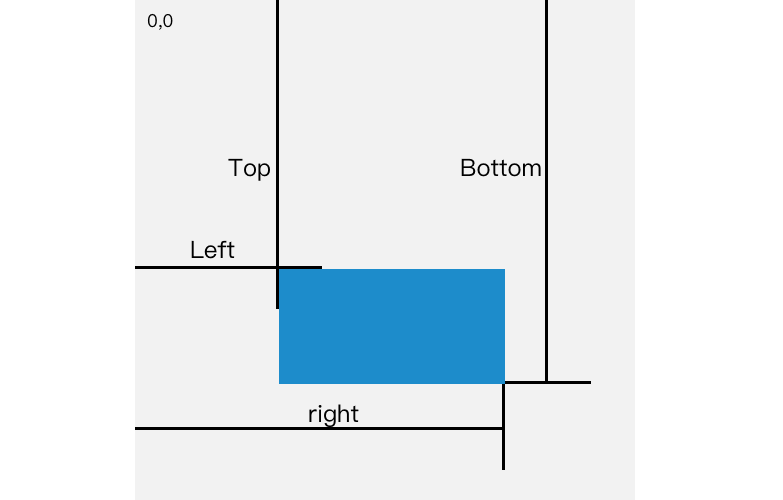

# 滚动吸顶实现方式

## offsetTop属性

用于获得当前元素到定位父级（ element.offsetParent ）顶部的距离（偏移值）。

> 定位父级 <font color=FF0000>offsetParent</font> 的定义是：与当前元素最近的 position != static 的父级元素。

由于有定位父级, 所以直接用offsetTop属性会有问题

## 方法目录

1. 使用 position:sticky 实现

2. 使用 JQuery 的 offset().top 实现

3. 使用原生的 offsetTop 实现

4. 使用 obj.getBoundingClientRect().top 实现

效果图：


### 一、使用 position:sticky 实现

**1、粘性定位是什么？**

粘性定位 sticky 相当于相对定位 relative 和固定定位 fixed 的结合；在页面元素滚动过程中，某个元素距离其父元素的距离达到 sticky 粘性定位的要求时；元素的相对定位 relative 效果变成固定定位 fixed 的效果。

**2、如何使用？**

使用条件：

- 父元素不能 overflow:hidden 或者 overflow:auto 属性

- 必须指定 top、bottom、left、right 4 个值之一，否则只会处于相对定位

- 父元素的高度不能低于 sticky 元素的高度

- sticky 元素仅在其父元素内生效

在需要滚动吸顶的元素加上以下样式便可以实现这个效果：

```js
.sticky {
    position: -webkit-sticky;
    position: sticky;
    top: 0;
}
```

**3、兼容性**

这个属性的兼容性并不是很好，因为这个 API 还只是实验性的属性。不过这个 API 在 IOS 系统的兼容性还是比较好的。

### 二、使用 JQuery 的 offset().top 实现

我们知道 JQuery 中封装了操作 DOM 和读取 DOM 计算属性的 API，基于 <font color=FF0000>offset().top</font> 这个 API 和 <font color=FF0000>scrollTop()</font> 的结合，我们也可以实现滚动吸顶效果。

```js
...
window.addEventListener('scroll', self.handleScrollOne);
...
handleScrollOne: function() {
    let self = this;
    let scrollTop = $('html').scrollTop();
    let offsetTop = $('.title_box').offset().top;
    self.titleFixed = scrollTop > offsetTop;
}
...
```

> scrolloTop() 有兼容性问题，在微信浏览器、IE、某些 firefox 版本中 $('html').scrollTop() 的值会为 0，于是乎也就有了第三种方案的兼容性写法。

### 三、使用原生的 offsetTop 实现

我们知道 offsetTop 是相对定位父级的偏移量，倘若需要滚动吸顶的元素出现定位父级元素，那么 offsetTop 获取的就不是元素距离页面顶部的距离。

我们可以自己对 offsetTop 做以下处理：

```js
getOffset: function(obj,direction){
    let offsetL = 0;
    let offsetT = 0;
    while( obj!== window.document.body && obj !== null ){
        offsetL += obj.offsetLeft;
        offsetT += obj.offsetTop;
        obj = obj.offsetParent;
    }
    if(direction === 'left'){
        return offsetL;
    }else {
        return offsetT;
    }
}
```

使用：

```js
...
window.addEventListener('scroll', self.handleScrollTwo);
...
handleScrollTwo: function() {
    let self = this;
    let scrollTop = window.pageYOffset || document.documentElement.scrollTop || document.body.scrollTop;
    let offsetTop = self.getOffset(self.$refs.pride_tab_fixed);
    self.titleFixed = scrollTop > offsetTop;
}
...
```

### 四、使用 obj.getBoundingClientRect().top 实现

这个 API 可以告诉你页面中某个元素相对浏览器视窗上下左右的距离。

使用：

tab 吸顶可以使用 obj.getBoundingClientRect().top 代替 scrollTop - offsetTop,代码如下：

```js
// html
<div class="pride_tab_fixed" ref="pride_tab_fixed">
    <div class="pride_tab" :class="titleFixed == true ? 'isFixed' :''">
        // some code
    </div>
</div>

// vue
export default {
    data(){
      return{
        titleFixed: false
      }
    },
    activated(){
      this.titleFixed = false;
      window.addEventListener('scroll', this.handleScroll);
    },
    methods: {
      //滚动监听，头部固定
      handleScroll: function () {
        let offsetTop = this.$refs.pride_tab_fixed.getBoundingClientRect().top;
        this.titleFixed = offsetTop < 0;
        // some code
      }
    }
  }
```

#### offsetTop 和 getBoundingClientRect() 区别

1. getBoundingClientRect():

用于获得页面中某个元素的左，上，右和下分别相对浏览器视窗的位置。不包含文档卷起来的部分。



该函数返回一个 object 对象，有8个属性：<font color=FF0000> top, right, buttom, left, width, height, x, y</font>

2. offsetTop:

用于获得当前元素到定位父级（ element.offsetParent ）顶部的距离（偏移值）。

> 定位父级 offsetParent 的定义是：与当前元素最近的 position != static 的父级元素。

offsetTop 和 offsetParent 方法相结合可以获得该元素到 body 上边距的距离。代码如下：

```js
getOffset: function(obj,direction){
    let offsetL = 0;
    let offsetT = 0;
    while( obj!== window.document.body && obj !== null ){
        offsetL += obj.offsetLeft;
        offsetT += obj.offsetTop;
        obj = obj.offsetParent;
    }
    if(direction === 'left'){
        return offsetL;
    }else {
        return offsetT;
    }
}
```

#### 延伸知识点

1. offsetWidth：

元素在水平方向上占用的空间大小：

offsetWidth =  border-left + padding-left + width + padding-right + border-right

2. offsetHeight：

元素在垂直方向上占用的空间大小：

offsetHeight =  border-top + padding-top + height + padding-bottom + border-bottom

> 注：如果存在垂直滚动条，offsetWidth 也包括垂直滚动条的宽度；如果存在水平滚动条，offsetHeight 也包括水平滚动条的高度；

3. offsetTop：

元素的上外边框至 offsetParent 元素的上内边框之间的像素距离；

4. offsetLeft：

元素的左外边框至 offsetParent 元素的左内边框之间的像素距离；

##### 注意事项:

- 所有偏移量属性都是只读的；

- 如果给元素设置了 display:none，则它的偏移量属性都为 0；

- 每次访问偏移量属性都需要重新计算（保存变量）；

- 在使用的时候可能出现 DOM 没有初始化，就读取了该属性，这个时候会返回 0；对于这个问题我们需要等到 DOM 元素初始化完成后再执行。


## 遇到的问题

### 一、吸顶的那一刻伴随抖动

出现抖动的原因是因为：在吸顶元素 position 变为 fixed 的时候，该元素就脱离了文档流，下一个元素就进行了补位。就是这个补位操作造成了抖动。

解决方案：

为这个吸顶元素添加一个等高的父元素，我们监听这个父元素的 getBoundingClientRect().top 值来实现吸顶效果，即：

```js
<div class="title_box" ref="pride_tab_fixed">
    <div class="title" :class="titleFixed == true ? 'isFixed' :''">
    // 使用 `obj.getBoundingClientRect().top` 实现
    </div>
</div>
```

### 二、吸顶效果不能及时响应

描述：

1. 当页面往下滚动时，吸顶元素需要等页面滚动停止之后才会出现吸顶效果

2. 当页面往上滚动时，滚动到吸顶元素恢复文档流位置时吸顶元素不恢复原样，而等页面停止滚动之后才会恢复原样

原因： 在 ios 系统上不能实时监听 scroll 滚动监听事件，在滚动停止时才触发其相关的事件。

解决方案：

第一种方案中的 position:sticky。这个属性在 IOS6 以上的系统中有良好的兼容性，所以我们可以区分 IOS 和 Android 设备做两种处理。

> IOS 使用 position:sticky，Android 使用滚动监听 getBoundingClientRect().top 的值。

## 性能优化篇

我们从两个方向做性能优化（其实是一个方向）：

1. 避免过度的 reflow
2. 优化滚动监听事件

### 过度的 reflow

滚动吸顶使用了 offsetTop 或者 getBoundingClientRect().top 来获取响应的偏移量,既然有读取元素的属性就自然会导致页面 reflow。

优化的方向就是从减少读取元素属性次数下手，查看代码发现一触发屏幕滚动事件就会调用相关方法读取元素的偏移量。

#### 优化方案

1. 牺牲平滑度满足性能，使用节流控制相关方法的调用

2. 使用 IntersectionObserver 和节流结合，也牺牲了平滑度。

##### 第一种方案

这个方案很常见，不过其带来的副作用也很明显，就是在吸顶效果会有些延迟，如果产品可以接受那就不失为一种好方法。

这样可以控制在一定时间内只读取

这里节流函数就直接是用 lodash.js 封装好的 throttle 方法。

```js
window.addEventListener('scroll', _.throttle(self.handleScrollThree, 50));
```

##### 第二种方案

第二种方案相对来说容易接受一点，就是支持 IntersectionObserver 就用 IntersectionObserver，否则就用 throttle。

我们先讲讲 IntersectionObserver

> IntersectionObserver 可以用来监听元素是否进入了设备的可视区域之内，而不需要频繁的计算来做这个判断。

通过这个属性我们就可以在元素不在可视范围内，不去读取元素的相对位置，已达到性能优化；当浏览器不支持这个属性的时候就使用 throttle 来处理。

使用 IntersectionObserver 和 throttle 优化的代码如下：

```js
IntersectionObserverFun: function() {
    let self = this;
    let ele = self.$refs.pride_tab_fixed;
    if( !IntersectionObserver ){
        let observer = new IntersectionObserver(function(){
            let offsetTop = ele.getBoundingClientRect().top;
            self.titleFixed = offsetTop < 0;
        }, {
            threshold: [1]
        });
        observer.observe(document.getElementsByClassName('title_box')[0]);
    } else {
        window.addEventListener('scroll', _.throttle(function(){
            let offsetTop = ele.getBoundingClientRect().top;
            self.titleFixed = offsetTop < 0;
        }, 50));
    }
}, 
```

> IntersectionObserver API 是异步的，不随着目标元素的滚动同步触发。

规格写明，IntersectionObserver的实现，应该采用 requestIdleCallback()。它不会立即执行回调，它会调用 window.requestIdleCallback() 来异步的执行我们指定的回调函数，而且还规定了最大的延迟时间是 100 毫秒。

> 这种 IntersectionObserver 和 throttle 结合的方案不失为一种可选择的方案，这种方案的优点就在于可以有效地减少页面 reflow 的风险，不过缺点也是有的，需要牺牲页面的平滑度。具体该如何取舍，就看业务的需要啦。

