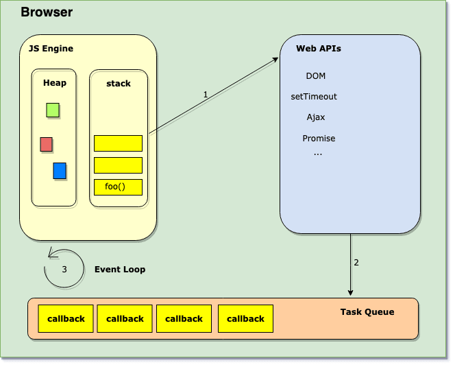
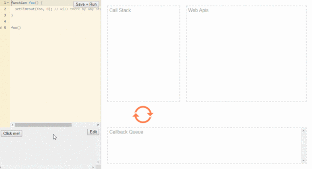

# JavaScript

## 1、如何用原生js给一个按钮绑定两个onclick事件？

- addEventListener

```js
//事件监听 绑定多个事件
var btn = document.getElementById("btn");
btn.addEventListener("click",hello1);
btn.addEventListener("click",hello2);
function hello1(){
 alert("hello 1");
}
function hello2(){
 alert("hello 2");
}
```

## 2、拖拽会用到哪些事件？

- dragstart:拖拽开始时在被拖拽元素上触发此事件,监听器需要设置拖拽所需数据,从操作系统拖拽文件到浏览器时不触发此事件.

- dragenter:拖拽鼠标进入元素时在该元素上触发,用于给拖放元素设置视觉反馈,如高亮

- dragover:拖拽时鼠标在目标元素上移动时触发.监听器通过阻止浏览器默认行为设置元素为可拖放元素.

- dragleave:拖拽时鼠标移出目标元素时在目标元素上触发.此时监听器可以取消掉前面设置的视觉效果.

- drag:拖拽期间在被拖拽元素上连续触发

- drop:鼠标在拖放目标上释放时,在拖放目标上触发.此时监听器需要收集数据并且执行所需操。如果是从操作系统拖放文件到浏览器,需要取消浏览器默认行为.

- dragend:鼠标在拖放目标上释放时,在拖拽元素上触发.将元素从浏览器拖放到操作系统时不会触发此事件.

## 3、document.write和innerHTML的区别？

- document.write是直接写入到页面的内容流，如果在写之前没有调用document.open, 浏览器会自动调用open。每次写完关闭之后重新调用该函数，会导致页面被重写。

- innerHTML则是DOM页面元素的一个属性，代表该元素的html内容。你可以精确到某一个具体的元素来进行更改。如果想修改document的内容，则需要修改document.documentElement.innerElement。

- innerHTML将内容写入某个DOM节点，不会导致页面全部重绘

- innerHTML很多情况下都优于document.write，其原因在于其允许更精确的控制要刷新页面的那一个部分。

## 4、什么是ajax? ajax的步骤？

- ajax(异步javascript xml) 能够刷新局部网页数据而不是重新加载整个网页。

- 如何使用ajax?

- 第一步，创建xmlhttprequest对象，var xmlhttp =new XMLHttpRequest（);XMLHttpRequest对象用来和服务器交换数据。

```js
var xhttp;
if (window.XMLHttpRequest) {
//现代主流浏览器
xhttp = new XMLHttpRequest();
} else {
// 针对浏览器，比如IE5或IE6
xhttp = new ActiveXObject("Microsoft.XMLHTTP");
}
```

- 第二步，使用xmlhttprequest对象的open（）和send（）方法发送资源请求给服务器。

- 第三步，使用xmlhttprequest对象的responseText或responseXML属性获得服务器的响应。

- 第四步，onreadystatechange函数，当发送请求到服务器，我们想要服务器响应执行一些功能就需要使用onreadystatechange函数，每次xmlhttprequest对象的readyState发生改变都会触发onreadystatechange函数。


## 5、xml和json的区别？

-  JSON相对于XML来讲，数据的体积小，传递的速度更快些

-  JSON与JavaScript的交互更加方便，更容易解析处理，更好的数据交互

-  XML对数据描述性比较好；

-  JSON的速度要远远快于XML；

## 6、js有几种数据类型，其中基本数据类型有哪些？

- 五种基本类型: Undefined、Null、Boolean、Number和String。

- 引用类型: Object、Array和Function。

### 7、undefined和null的区别？

- null： Null类型，代表“空值”，代表一个空对象指针，使用typeof运算得到 “object”，所以你可以认为它是一个特殊的对象值。

- undefined： Undefined类型，当一个声明了一个变量未初始化时，得到的就是undefined。

- null是javascript的关键字，可以认为是对象类型，它是一个空对象指针，和其它语言一样都是代表“空值”，不过 undefined 却是javascript才有的。

- undefined是在ECMAScript第三版引入的，为了区分空指针对象和未初始化的变量，它是一个预定义的全局变量。没有返回值的函数返回为undefined，

- 没有实参的形参也是undefined。

- javaScript权威指南：
    1. null 和 undefined 都表示“值的空缺”，你可以认为undefined是表示系统级的、
    2. 出乎意料的或类似错误的值的空缺，而null是表示程序级的、正常的或在意料之中的值的空缺

## 8、JS哪些操作会造成内存泄露？

（1）意外的全局变量引起的内存泄露。
```js
function leak(){  
  leak="xxx";//leak成为一个全局变量，不会被回收  
}
```

（2）闭包引起的内存泄露。

（3）没有清理的DOM元素引用。

（4）被遗忘的定时器或者回调 

（5）子元素存在引起的内存泄露。

## 9、怎样添加、移除、移动、复制、创建和查找节点？

（1）创建新节点
- createDocumentFragment() //创建一个DOM片段
- createElement() //创建一个具体的元素
- createTextNode() //创建一个文本节点

（2）添加、移除、替换、插入
- appendChild() //添加
- removeChild() //移除
- replaceChild() //替换
- insertBefore() //插入

（3）查找
- getElementsByTagName() //通过标签名称
- getElementsByName() //通过元素的Name属性的值
- getElementById() //通过元素Id，唯一性

## 10、$(document).ready()方法和window.onload有什么区别？

(1)、window.onload方法是在网页中所有的元素(包括元素的所有关联文件)完全加载到浏览器后才执行的。

(2)、$(document).ready() 方法可以在DOM载入就绪时就对其进行操纵，并调用执行绑定的函数。

## 11. 类型及其转换
- JavaScript 内置了7种类型：==null==, ==undefined== , ==boolean==, ==number==, ==string==, ==object以及== ==symbol== (ES6).
    1. 原始类型（基本类型）：按值访问，可以操作保存在变量中实际的值。原始类型汇总中null和undefined比较特殊。
    2. 引用类型：引用类型的值是保存在内存中的对象。
    3. 与其他语言不同的是，JavaScript不允许直接访问内存中的位置，也就是说不能直接操作对象的内存空间。在操作对象时，实际上是在操作对象的引用而不是实际的对象。所以引用类型的值是按引用访问的。

- 除了 object 以外，这几种类型都可以归类为原始类型。

- Undefined 表示尚未定义。它被用作表示未初始化变量，未提供的函数参数，对象缺少的属性的默认值。当函数没有返回值时也会默认返回 undefined .

- Null 则表示空值。它可以被赋值给一个变量来表示的“没有值”。

- 隐式类型转换:
    - Falsy 类型的值是指在强制类型转换时会被转换为布尔 false 的值。包括："", 0, null, undefined, NaN, false.
    - 除了 Falsy 类型值以外的都被称为 truthy 类型值，它们会被转换为 true.空的数组，对象和函数布尔值也会被转换为 true ！

- String & Number 运算
    - 你需要注意的第一件事是 + 操作符。这是一个棘手的操作符，因为它同时适用于数值运算和字符串连接。

    - 但是，*，/和-操作符都是数字运算专用的。当这些运算符与字符串一起使用时，会强制转换字符串为数字类型的值。
    
- == 与 ===
    - 事实上，== 是比较强制类型转换之后的结果，而 === 则是直接比较。

- 基本类型中的number,string和boolean都有对应的包装类型。

```js
var str = "string";//string
var strObj = new String("string");//String {0:"s",1:'t'···}

```
把一个基本类型尝试用对象的方式使用它的时候，比如访问length属性，或者增加一些属性的操作时，javascript会把这些基本类型转化为对应的包装类型对象。完成这样一个访问比如a.length返回以后或者a.t设置了以后，这个临时对象会被销毁掉。所以a.t赋值3了以后，再去输出a.t值是undefined。

str，number和true都有包装类型，所以可以把数字用括号括起来调用toString()方法

```js
(123).toString();==='123'

```
---

## 12. 函数问题

```js
function Foo () {
 getName = function () { alert(1) }
 return this
 }
 Foo.getName = function () { alert(2) }
 
 Foo.prototype.getName = function () { alert(3) }
 var getName = function () { alert(4) }
 function getName () { alert(5) }
 Foo.getName();
 getName();
 Foo().getName();
 getName();
 new Foo.getName();
 new Foo().getName();
 new new Foo().getName();

// 答案
 Foo.getName(); //2
 getName(); //4
 Foo().getName(); //1
 getName();//1
 new Foo.getName(); //2
 new Foo().getName(); //3
 new new Foo().getName(); //3
```
- 此题涉及的知识点众多，包括变量定义提升、this指针指向、运算符优先级、原型、继承、全局变量污染、对象属性及原型属性优先级等等

### 1. 第一问

- 解析
    1. 首先定义了一个叫Foo的函数
    
    2. 之后为Foo创建了一个叫getName的静态属性存储了一个匿名函数
    
    3. 之后为Foo的原型对象新创建了一个叫getName的匿名函数。
    
    4. 之后又通过函数变量表达式创建了一个getName的函数
    
    5. 最后再声明一个叫getName函数。

- 第一问的 Foo.getName 自然是访问Foo函数上存储的静态属性，自然是2

### 2. 第二问

- 直接调用 getName 函数。既然是直接调用那么就是访问当前上文作用域内的叫getName的函数，所以跟1 2 3都没什么关系。此处有两个坑，一是变量声明提升，二是函数表达式。

- 变量声明提升：即所有声明变量或声明函数都会被提升到当前函数的顶部。
    注意：
    1. 初始化不会提升。
    2. 函数提升优先级高于变量提升，且不会被变量声明覆盖，但是会被变量赋值之后覆盖
    
- 例如下代码：

```js
console.log(x);//输出：function x(){}
var x=1;
function x(){}
```
- 实际执行的代码为，先将 var x=1 拆分为 var x; 和 x = 1; 两行，再将 var x;(变量声明提升) 和 function x(){}（函数提升优先级高于变量提升） 两行提升至最上方变成：

```js
function x(){}
var x;//仅仅是声明不会覆盖！所以后面还是fun
console.log(x);//输出
x=1
```
- 所以最终函数声明的x覆盖了变量声明的x，log输出为x函数。

```js
function Foo() {
 getName = function () { alert (1); };
 return this;
}
function getName() { alert (5);}//提升函数声明，覆盖var的声明
var getName;//只提升变量声明
Foo.getName = function () { alert (2);};
Foo.prototype.getName = function () { alert (3);};
getName = function () { alert (4);};//最终的赋值再次覆盖function getName声明
getName();//最终输出4
```

### 3. 第三问

- 第三问的 Foo().getName(); 先执行了Foo函数，然后调用Foo函数的返回值对象的getName属性函数。

- Foo函数的第一句 getName = function () { alert (1); }; 是一句函数赋值语句，注意它没有var声明，所以先向当前Foo函数作用域内寻找getName变量，没有。再向当前函数作用域上层，即外层作用域内寻找是否含有getName变量，找到了，也就是第二问中的alert(4)函数，将此变量的值赋值为 function(){alert(1)}。

- 此处实际上是将外层作用域内的getName函数修改了。

- **注意：此处若依然没有找到会一直向上查找到window对象，若window对象中也没有getName属性，就在window对象中创建一个getName变量。**

- 遂Foo函数返回的是this(window对象)，相当于执行 window.getName() ，而window中的getName已经被修改为alert(1)，所以最终会输出1

### 4. 第四问

- 直接调用getName函数，相当于 window.getName() ，因为这个变量已经被Foo函数执行时修改了，遂结果与第三问相同，为1

### 5. 第五问

- 第五问 new Foo.getName(); ,此处考察的是js的运算符优先级问题。
 
- 通过查文档可以得知点（.）的优先级高于new（无参数列表）操作，遂相当于是: **new (Foo.getName)();**

- 所以实际上将getName函数作为了构造函数来执行，遂弹出2。

### 6. 第六问

- 第六问 new Foo().getName() ，比较的是 new(有参数)、成员访问、执行函数()的优先级，这几个是同级的，从左到右依次执行，就是((new Foo()).getName)()，遂先执行Foo函数，而Foo此时作为构造函数却有返回值，所以这里需要说明下什么是**new(有参数列表)和js中的构造函数返回值问题。**

- new(有参数列表)
    1. new(有参数列表)，例如：new abc()或者new abc(...arg)
    2. new(无参数列表)，例如：new abc

- 构造函数的返回值：在传统语言中，构造函数不应该有返回值，实际执行的返回值就是此构造函数的实例化对象。而在js中构造函数可以有返回值也可以没有。
    - 1、没有返回值则按照其他语言一样返回实例化对象。
    ```js
    function F() {} // undefined
    new F() // F {}
    ```
    - 2、若有返回值则检查其返回值是否为引用类型。如果是非引用类型，如基本类型（string,number,boolean,null,undefined）则与无返回值相同，实际返回其实例化对象。
    ```js
    function F() {return true;} // undefined
    new F() // F {}
    ```
    
    - 3、若返回值是引用类型，则实际返回值为这个引用类型。
    ```js
    function F() {return {a: 1}} // undefined
    new F() // Object{a: 1}
    ```
- 原题中，返回的是this，而this在构造函数中本来就代表当前实例化对象，遂最终Foo函数返回实例化对象。

- 之后调用实例化对象的getName函数，因为在Foo构造函数中没有为实例化对象添加任何属性，遂到当前对象的原型对象（prototype）中寻找getName，找到了。

### 7. 第七问

- 第七问, new new Foo().getName(); 同样是运算符优先级问题。最终实际执行为：new ((new Foo()).getName)();

- 先初始化Foo的实例化对象，然后将其原型上的getName函数作为构造函数再次new。

## 13. "newArray"中有哪些元素？

```js
var array = [];
for(var i = 0; i <3; i++) {
 array.push(() => i);
}
var newArray = array.map(el => el());
console.log(newArray); // ??   
```

- 在for循环的头部声明带有var关键字的变量会为该变量创建单个绑定（存储空间）。阅读更多关于闭包的信息。让我们再看一次for循环。

```js
// 误解作用域:认为存在块级作用域
var array = [];
for (var i = 0; i < 3; i++) {
  // 三个箭头函数体中的每个`'i'`都指向相同的绑定，
  // 这就是为什么它们在循环结束时返回相同的值'3'。
  array.push(() => i);
}
var newArray = array.map(el => el());
console.log(newArray); // [3, 3, 3]
```

- 如果使用 let 声明一个具有块级作用域的变量，则为每个循环迭代创建一个新的绑定。

```js
// 使用ES6块级作用域
var array = [];
for (let i = 0; i < 3; i++) {
  // 这一次，每个'i'指的是一个新的的绑定，并保留当前的值。
 // 因此，每个箭头函数返回一个不同的值。
  array.push(() => i);
}
var newArray = array.map(el => el());
console.log(newArray); // [0, 1, 2]
```

- 另一种方法是使用闭包。

```js
let array = [];
for (var i = 0; i < 3; i++) {

  array[i] = (function(x) {
    return function() {
      return x;
    };
  })(i);
}
const newArray = array.map(el => el());
console.log(newArray); // [0, 1, 2] 
```

## 14. 如果我们在浏览器控制台中运行'foo'函数，是否会导致堆栈溢出错误？

```js
function foo() {
  setTimeout(foo, 0); // 是否存在堆栈溢出错误?
};  
```
- 解答：不会溢出

- JavaScript并发模型基于“事件循环”。当我们说“浏览器是 JS 的家”时我真正的意思是浏览器提供运行时环境来执行我们的JS代码。

- 浏览器的主要组件包括调用堆栈，事件循环，任务队列和Web API。像setTimeout，setInterval和Promise这样的全局函数不是JavaScript的一部分，而是 Web API 的一部分。JavaScript 环境的可视化形式如下所示：



- JS调用栈是后进先出(LIFO)的。引擎每次从堆栈中取出一个函数，然后从上到下依次运行代码。每当它遇到一些异步代码，如setTimeout，它就把它交给Web API(箭头1)。因此，每当事件被触发时，callback 都会被发送到任务队列（箭头2）。

- 事件循环(Event loop)不断地监视任务队列(Task Queue)，并按它们排队的顺序一次处理一个回调。每当调用堆栈(call stack)为空时，Event loop获取回调并将其放入堆栈(stack )(箭头3)中进行处理。请记住，如果调用堆栈不是空的，则事件循环不会将任何回调推入堆栈。

- **步骤**
    
    1. 调用 foo()会将foo函数放入调用堆栈(call stack)。
    
    2. 在处理内部代码时，JS引擎遇到setTimeout。
    
    3. 然后将foo回调函数传递给WebAPIs(箭头1)并从函数返回，调用堆栈再次为空
    
    4. 计时器被设置为0，因此foo将被发送到任务队列`<Task Queue>`(箭头2)。
    
    5. 由于调用堆栈是空的，事件循环将选择foo回调并将其推入调用堆栈进行处理。
    
    6.进程再次重复，堆栈不会溢出。

 


## 15. 运行以下代码片段时，控制台上会打印什么？

```js
var obj = { a: 1, b: 2 };
Object.setPrototypeOf(obj, {c: 3});
Object.defineProperty(obj, 'd', { value: 4, enumerable: false });

// what properties will be printed when we run the for-in loop?
for(let prop in obj) {
    console.log(prop);
} 
```

- 解答： a, b, c

- 解析：for-in循环遍历对象本身的可枚举属性以及对象从其原型继承的属性。可枚举属性是可以在for-in循环期间包含和访问的属性。

```js
var obj = { a: 1, b: 2 };
var descriptor = Object.getOwnPropertyDescriptor(obj, "a");
console.log(descriptor.enumerable); // true
console.log(descriptor);
// { value: 1, writable: true, enumerable: true, configurable: true }
```
- 现在你已经掌握了这些知识，应该很容易理解为什么我们的代码要打印这些特定的属性
```js
var obj = { a: 1, b: 2 }; //a，b 都是 enumerables 属性

// 将{c：3}设置为'obj'的原型，并且我们知道
// for-in 循环也迭代 obj 继承的属性
// 从它的原型，'c'也可以被访问。
Object.setPrototypeOf(obj, { c: 3 });

// 我们在'obj'中定义了另外一个属性'd'，但是 
// 将'enumerable'设置为false。 这意味着'd'将被忽略。
Object.defineProperty(obj, "d", { value: 4, enumerable: false });

for (let prop in obj) {
  console.log(prop);
}
// 打印
// a
// b
// c
```

