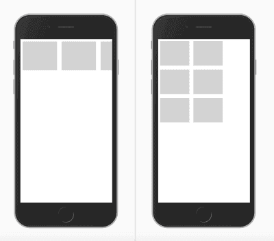

# 前端项目中常见的 CSS 问题

## 1. 重设 button、input 元素的背景

在添加一个按钮时，记得重设它的背景，不然在不同浏览器下它将呈现不同的效果。下面这个例子是同一个按钮在 Chrome 和 Safari 中所展示出的样子。后者多了一个默认的灰色背景。


- 重设它的背景可以解决这个问题：

```css
button {
  appearance: none;
  background: transparent;
  /* Other styles */
}
```

## 2. Overflow: scroll vs. auto

要固定一个元素的高度，并允许用户进行滚动查看，可添加<font color=FF0000>overflow: scroll-y</font>。这在 macOS 版的 Chrome 下是没有问题的。然而，如果是在 Windows 下的话，滚动栏就会一直存在（即便元素的内容很短）。这是因为 <font color=FF0000>scroll-y</font> 不管元素的内容如何都会显示出滚动栏，如果使用 <font color=FF0000>overflow: auto </font>的话就只会在必要的时候才展示出滚动栏。


```css
.element {
    height: 300px;
    overflow-y: auto;
}
```

## 3. flex布局

### 1. 添加 flex-wrap

要使一个元素变成 flex 容器，只需添加 display: flex 即可；但如果只是这样，而没有添加 flex-wrap 的话，当屏幕尺寸缩小时，浏览器就会展示出一个水平滚动栏。

```html
<div class="wrapper">
  <div class="item"></div>
  <div class="item"></div>
  <div class="item"></div>
  <div class="item"></div>
  <div class="item"></div>
  <div class="item"></div>
</div>
```

```css
.wrapper {
  display: flex;
}

.item {
  flex: 0 0 120px;
  height: 100px;
}
```

上面这个例子在大屏幕下效果会不错；但在移动端的话，浏览器就会展示出一个水平滚动栏。



- 解决方法非常简单：让 wrapper 知道当空间不够用时，应该对元素进行换行排列。

```css
.wrapper {
    display: flex;
    flex-wrap: wrap;
}
```

### 2. 如果元素的数量是动态的话，不要使用 justify-content: space-between

如果把 <font color=FF0000>justify-content: space-between</font> 应用在一个 flex 容器上，它将会把它的元素按照等距的间隔来排列。在我们的例子中有 8 张卡片元素，看上去效果不错。但如果因为某些原因，他们的数量变成了 7 会怎样？——第二行的元素显示效果就会与第一行不一样。


- 其实在这种场景下，使用 grid 布局会更加合适。

## 4. 长词和长链

在移动设备屏幕上查看一篇文章时，长词或长链可能会导致水平滚动栏的出现；使用 word-break 可以防止这个问题发生。


## 5. 渐变中的透明色

当添加用 transparent 作为渐变的开始或结束点的渐变时，在 Safari 中会显示成乌黑的效果。这是因为 Safari 并不能识别 transparent 关键字。把它替换成 rgba(0, 0, 0, 0) 就好了。仔细看下面的截图：

